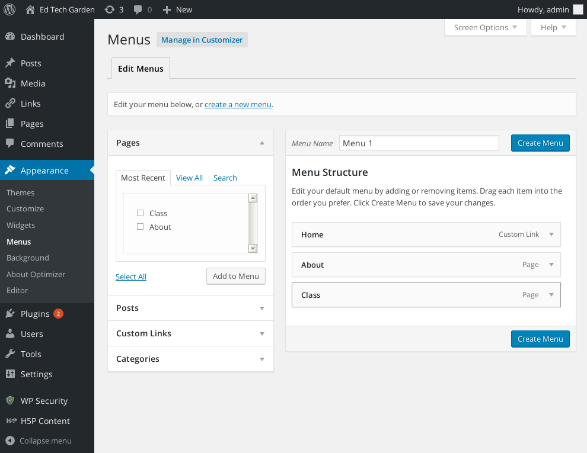
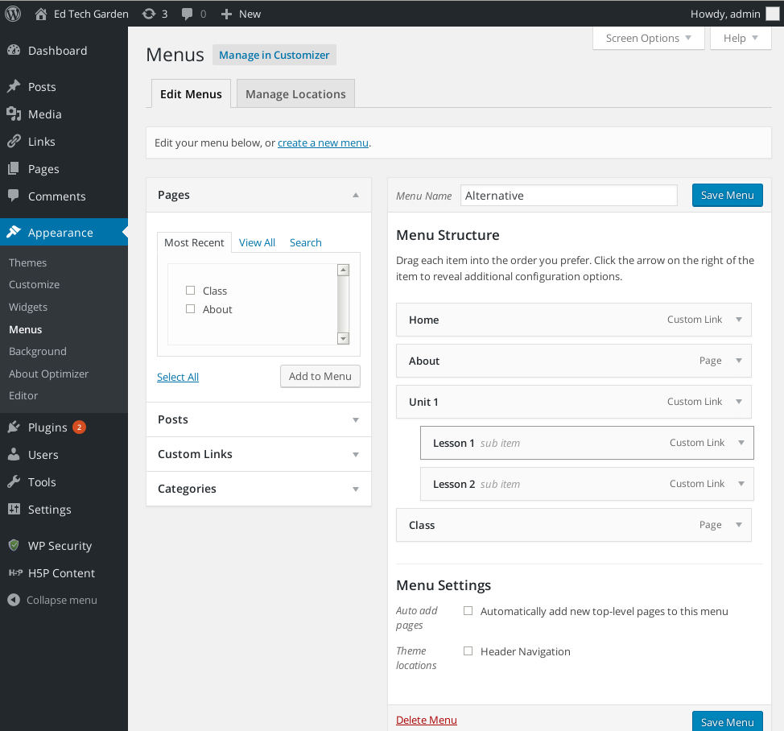
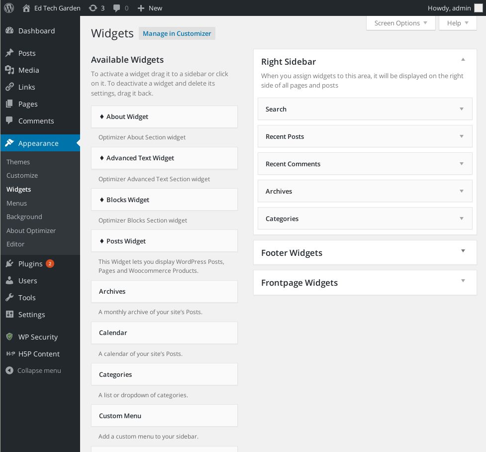

Title: Session 4 - Expand and Organize
Date: 2016-03-23 13:00
Category: buildweb
Tags: session4
Type: section
Slug: session4

## Tasks

### Site Building

* Add Widgets and a Menu to your site
* Understand Archive Pages

### Online Courses

* Fundamentals of making positive contributions online

### Web Fundamentals

* Web logs/stats
* 3rd party media hosting

----

## Growing your site

By now you have built the basics of your site. You have written a post, written a page, selected and a theme for your site, and you have customized it. This session we are going to take a more detailed look at how to use menus and widgets to organize your site's content in ways that are convenient for visitors and functional for you. We will also look at how you can manage participation on your site with plugins and how you can check what portions of your site are actually being visited. 

### Organizing your site with Menus, Widgets and Archive pages

[Last session](session3.html), we learned about the five [basic building blocks](wordpressanatomy.html) of a WordPress site: posts, pages, widgets, menus, and archive pages. Posts and pages are the main ways to add content to your site and you should already have built one of each and have a general idea of the different uses for each. If not, this week's organization work should help out. The remaining three elements, widgets, menus, and archive pages, are tools for organizing and sifting through the material on your site. Almost every site will use at least one of these three tools and most sites will use all three so we will go through them one by one.

#### Sorting your posts with Archive pages 

Archive pages are a little like saved searches. They look at your Posts and choose which ones to include or how to arrange them based on certain features of those Posts. By default WordPress builds archive pages for Date, Category, and Author. The Author page includes all posts by an individual author. Category pages will only include posts with that category set. Date archive pages can either be set to include all your posts organized by date or only those posts from a particular date range.

The main difference between Posts and Pages is that Posts have all these characteristics (author, date, and category) while Pages do not. This gives you much more flexibility in organizing and sorting through Posts on your site. That is very useful in configuring how the materials on your site are arranged.

#### Arranging your pages with a menu

Just as Archive pages help you organize and display your Posts, menus help you organize and display your pages. How many menus your site has room for is set by your theme. Almost every site will have at least one menu and most themes will put your main menu at the top of the page. Generally your theme will include this same menu on all of your pages so this is where you can include the links to other sections of your site. 

To create a menu, go to the administrative dashboard and hover over the Appearance menu to get to the Menu item. You can also go directly to `YOUR.SITE/wp-admin/nav-menus.php`. 

On the left here you have all the things you can add to your menu. On the right you have your current menu. At the top of the left side you have the ability to create new menus, to switch between which menu you are working on, and to control which of your menus will show up on which portions of your site. You can have as many menus as you want though most themes will only have space for one or two by default.

Your first step is to create a new menu so hit the "create new menu" button. Go ahead and give this menu a name and add something from the left column. You add items by opening up the little collapsible item on the left that matches the kind of item you want to add to your menu, ie Post, Page, Custom link, etc, filling out any information you need in that little area, and then hitting the "Add To Menu" button. Most of these just require picking items from the list but the "Custom Link" option also gives you the ability to change what the item is called. You can use this for any external web links you want to include in your site, or to give custom names to menu entries for other items in your site. Anything that you can get a web URL for, you can add through "Custom Links".

Go ahead and add a couple of items to your menu. You probably want to include at least your About page and make sure to try out adding an external site you use through the "Custom Link" option. Once you have items on your menu you can rearrange them or make them into sub menus just by dragging them around. The top item on your menu will be the left most item when displayed on your site. To make a sub menu you indent menu items underneath the item you want yo be the top item in the menu. So a sub menu under "Unit 1" would look like this: 

You can add any item you want to your menu. Most of the time you are going to be adding Pages, because those are the big fixed landmarks in your site but you can also include Archive pages here by including items from the "Categories" item in the Menu toolbar.  

When you are done creating your Menu hit the "Save Menu" button. Now we need to tell WordPress to use your new menu in one of the locations for menus that your theme has set up. To do that simply click on the "Menu Settings" at the bottom of the menu area and check one of the theme areas listed to make your menu show up in that location. You can also go to the top left of the screen and use the "Manage Locations" tab to accomplish the same task. Depending on your theme you may have no menu locations or many of them. You are most likely to have one or two.

#### Tying everything together with widgets

Widgets are little building blocks for your site that can do a variety of things from simply displaying custom text to including recent social media posts on your site, all the way up to being little contact forms. Most often widgets are used to give quick access to content on your site that you do not want on the main site navigation menu. Just like with menus, your theme defines certain areas where you can put widgets and then you control what goes in those areas. Also like menus, your Widget area lists the various available widgets on the left of the screen and then gives you options for where to place them on the right:

A typical WordPress site has one or more sidebars where you put widgets. These widgets generally contain some way of accessing the different archive pages for a site. Unlike on a menu where you only have static links, widgets are generally dynamic and more interactive. For example you might have a calendar widget that will link people to your various posts by date or you could have a category list widget that will automatically include links to every category of posts on your site. 

There are more than a dozen default widgets you can use and many many more that are available as plugins for WordPress. You can use your widget areas to display information you want displayed on every page like your contact information or an additional custom menu. Some themes will also contain widget areas that only appear on particular pages, like the "Front Page Widgets" listed in the picture above. 

Go ahead and add the category and calendar widgets to your side bar and open a new window to view what they look like on your site. If your theme has multiple widget areas listed on the widgets page go ahead and add a different widget to each area so you can see where elements in each of these areas appear on your site. 

### Matter of preference

WordPress gives you a lot of flexibility in how to organize the materials on your site so how you arrange items is really a question of personal preference and what you think will be most useful for visitors.

For example, if you are building a course site with different units and lessons, you could make one menu item that lists all of the lessons. This makes it very easy to get to any lesson from the main menu but means you need to manually add every new lesson to your menu and your menu may grow unwieldy if you have too many items. Alternately, you could make each lesson a post with a Category for which unit it is in. That way you can just link to archive pages for each unit and all the lessons will be automatically included. The downside is that people will have to open the unit page in order to find individual lessons so they will lose the convenience of being able to get to any lesson directly from the main menu. 

If you are looking for ideas, take a look at how content is organized on some of the other sites you visit. How do you get to the content you are looking for? How do you even know what content is available on that site? This is also a great time to ask someone else to take a look at your site and see if they have any trouble finding things. A fresh set of eyes can be very useful to double check your instincts. 
